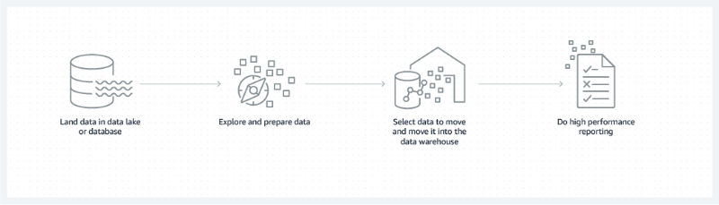
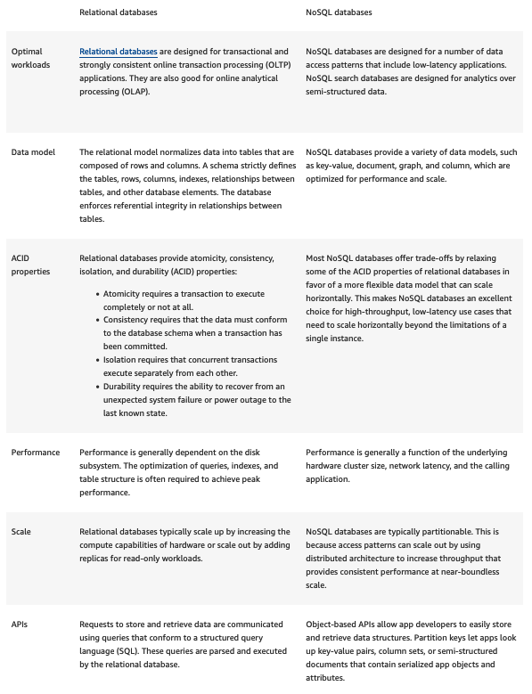
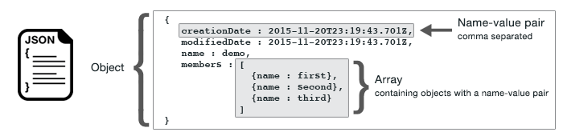
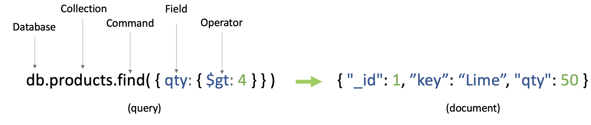
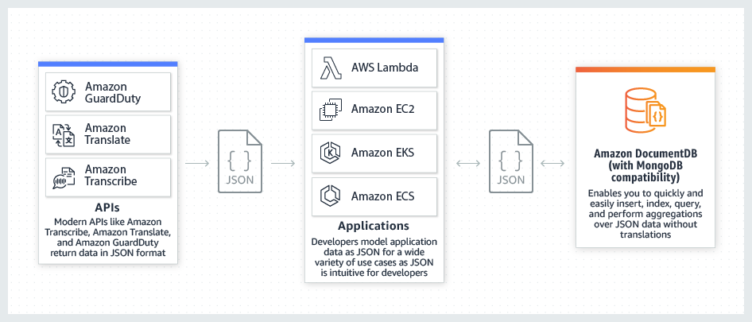

<div align="center">
    
    <h1> Databases Handbook </h1>
</div>

This repository was created with the intention diving into a rich collection of insights, best practices, and practical code examples. From fundamental concepts to advanced techniques, this repository equips developers with the tools to build robust, optimized, and secure databases.

# Table Of Contents

- [What is a database?](#what-is-a-database)
  - [Why is a database important? ](#why-is-a-database-important)
  - [What are the types of databases?](#what-are-the-types-of-databases)
  - [What is a database model?](#what-is-a-database-model)
  - [How did databases evolve?](#how-did-databases-evolve)
  - [What are modern databases?](#what-are-modern-databases)
  - [What is a datastore?](#what-is-a-datastore)
  - [What are databases used for?](#what-are-databases-used-for)
  - [How can AWS Cloud Databases help?](#how-can-aws-cloud-databases-help)
- [What is SQL?](#what-is-sql)
  - [Why is SQL important?](#why-is-sql-important)
  - [What are the components of a SQL system?](#what-are-the-components-of-a-sql-system)
  - [How does SQL work?](#how-does-sql-work)
  - [What are SQL commands?](#what-are-sql-commands)
  - [What are SQL standards?](#what-are-sql-standards)
  - [What is SQL injection?](#what-is-sql-injection)
  - [What is MySQL?](#what-is-mysql)
  - [What is NoSQL?](#what-is-nosql)
  - [What is a SQL server?](#what-is-a-sql-server)
  - [How does AWS support SQL?](#how-does-aws-support-sql)
- [What is NoSQL?](#what-is-nosql)
  - [What are the advantages of NoSQL databases](#what-are-the-advantages-of-nosql-databases)
  - [What are the use cases of NoSQL databases](#what-are-the-use-cases-of-nosql-databases)
  - [How do NoSQL databases work](#how-do-nosql-databases-work)
  - [What are the types of NoSQL databases](#what-are-the-types-of-nosql-databases)
  - [What are the differences between NoSQL and SQL databases](#what-are-the-differences-between-nosql-and-sql-databases)
  - [When should you choose NoSQL databases over SQL databases](#when-should-you-choose-nosql-databases-over-sql-databases)
  - [How can AWS support your NoSQL database requirements](#how-can-aws-support-your-nosql-database-requirements)
- [What is JSON?](#what-is-json)
  - [What is a JSON document database?](#what-is-a-json-document-database)
  - [Relational Database vs JSON Document Database Terminology](#relational-database-vs-json-document-database-terminology)
  - [Use cases for a JSON document database](#use-cases-for-a-json-document-database)

Sources:

- [What is a database?](https://aws.amazon.com/what-is/database/)
- [What is SQL (Structured Query Language)?](https://aws.amazon.com/what-is/sql/)
- [What is NoSQL?](https://aws.amazon.com/nosql/)
- [What is JSON?](https://aws.amazon.com/documentdb/what-is-json/)

# What is a database?

A database is an electronically stored, systematic collection of data. It can contain any type of data, including words, numbers, images, videos, and files. You can use software called a database management system (DBMS) to store, retrieve, and edit data. In computer systems, the word _database_ can also refer to any DBMS, to the database system, or to an application associated with the database.

### Why is a database important?

A high-performing database is crucial to any organization. Databases support the internal operations of companies and store interactions with customers and suppliers. They also hold administrative information and more specialized data, such as engineering or economic models. Examples include digital library systems, travel reservation systems, and inventory systems. The following are some reasons why databases are essential.

**Efficient scaling**

Database applications can manage large amounts of data, scaling to millions, billions, and more. It’s impossible to store this quantity of digital data without a database.

**Data integrity**

Databases often have built-in rules and conditions to maintain data consistency.

**Data security**

Databases support privacy and compliance requirements associated with any data. For example, to gain database access, users must log in. Different users might also have different levels of access, such as read-only.

**Data analytics**

Modern software systems use databases to analyze data. These systems can identify trends and patterns or make predictions. Data analytics help an organization make business decisions with confidence.

### What are the types of databases?

You can classify databases according to their use case, data type, and data storage method. Here are three examples of ways to classify databases:

- By their contents, such as document text, statistics, or multimedia objects
- By their application area, such as accounting, film, or manufacturing
- By their technical aspects, such as the database structure or interface type

### What is a database model?

A database model shows the logical structure of a database. It defines the relationships and rules that determine how data can be stored, organized, and manipulated. Each database application is built on a specific data model. Individual database models are designed based on the rules and concepts of the broader data model that the underlying application adopts.

<div align="center">
    
</div>

### How did databases evolve?

The earliest databases were magnetic tapes with data records stored sequentially. Databases continued to evolve with advances in technology. They have now become complex, high-performing systems with their own dedicated field of study. Let’s look at how data models evolved.

**Hierarchical database**

Hierarchical databases became popular in the 1970s. Instead of storing data records sequentially, they held them in a _tree structure_, establishing a parent-child relationship between two files. For example, to create a database system for a furniture retail store, you could define _bedroom_ as a parent record with _bed_, _bedside_ _table_, and _wardrobe_ as child records. The _bed_ record could further have more child records such as _single bed_, _double bed_, _queen bed_, and so on. Unfortunately, the hierarchical data model was complex to implement and couldn’t handle multiple parent-child relationships without significant data duplication.

**Network database**

Another early database, the network data model, allowed one child record to have multiple parent records and vice versa. So in the furniture store example, if you had two parent records, _bedroom_ and _kid room_, both could link to the child record _wardrobe_.

**Relational database**

In the 1980s, the relational database emerged as a popular enterprise model due to its productivity, flexibility, and compatibility with faster hardware. Relational databases organized records as several tables instead of linked lists.

In a relational database model, each category has a table, with category attributes as columns and data records as rows. For example, you can model the furniture retail store as a set of tables—_Rooms and Furniture_. The tables are linked by the columns—_Room number_ and _Furniture name_. Both of these columns are also called _primary keys_.

| Room number | Room name |
| ----------- | --------- |
| 1           | Bedroom   |
| 2           | Kids room |

| Furniture name | Color |
| -------------- | ----- |
| Bed            | Brown |
| Wardrobe       | White |
| Bedside table  | Black |

| Room number | Furniture name |
| ----------- | -------------- |
| 1           | Bed            |
| 1           | Wardrobe       |
| 2           | Wardrobe       |

#### Object-oriented database

Object-oriented databases evolved in the 1990s in response to the emergence of object-oriented programming. Programmers and designers began to treat the data in their databases as objects. For instance, you can map a chair’s attributes, such as color and size, to a chair data object. This object is a virtual representation of the real-world chair in the object-oriented database.

### NoSQL database

SQL is a query language used to retrieve, access, and edit data in relational databases. NoSQL represents the opposite, a database mechanism that does not use tabular relationships in data modeling. [NoSQL databases](https://aws.amazon.com/nosql/) were created at the start of the twenty-first century when cluster computing and distributed database architectures emerged. Distributed architectures store one large database over multiple underlying storage devices. This arrangement is called horizontal scaling. The software mechanisms used in NoSQL are high speed, no requirement for fixed table schemas, the ability to store duplicated or grouped data, and the ability to scale horizontally.

### What are modern databases?

The databases used today have evolved to scale both vertically and horizontally. They can store vast data in the cloud and provide advanced software interfaces for machine learning and other data analytics.

**Cloud database**

A cloud database typically runs on a cloud-computing platform. There are two standard deployment models: users can run databases on the cloud independently or purchase access from a cloud database provider. Cloud databases can follow both SQL and NoSQL data models.

**Graph database**

[Graph databases](https://aws.amazon.com/nosql/graph/) are useful because they prioritize the relationships between different data records. They are purpose-built to store and navigate relationships. A graph database consists of nodes and edges. Nodes store data objects, and edges store relationships between objects. An edge always has a start node, end node, type, and direction. It can describe parent-child relationships, actions, and ownership. There is no limit to the number and kinds of relationships a node can have.

**In-memory database**

While most databases are stored on external storage devices, an in-memory database resides in a computer’s internal memory. However, it is typically backed up by computer data storage as well. In-memory databases are faster than disk databases. They are often used where response time is critical, such as in telecommunications network equipment.

### What is a datastore?

_Datastore_ is a broad term for the very large data repository of any enterprise. Organizations produce all types of data, including files, documents, videos, customer data, application data, and system data. They use a datastore to process and store all their data, using it for analytics, applications, and data-driven decision making.

[Amazon Redshift](https://aws.amazon.com/redshift/?whats-new-cards.sort-by=item.additionalFields.postDateTime&whats-new-cards.sort-order=desc&-new-cards.sort-order=desc) is a fully managed, petabyte-scale data warehouse service in the cloud. You can start with just a few hundred gigabytes of data and scale to a petabyte or more.

### What are databases used for?

All industries use databases for a variety of use cases. The following are some examples:

**Fraud detection**

Graph databases help with identity management and fraud detection. Machine learning algorithms find patterns and detect fraudulent activity automatically and preemptively.

**Document management**

NoSQL databases store and manage documents, such as articles and contracts. They also allow organizations to query and index documents.

**Gaming and entertainment**

Many gaming and entertainment companies use databases extensively to provide rich media experiences, such as simultaneous login access for millions of users.

### How can AWS Cloud Databases help?

[AWS Cloud Databases](https://aws.amazon.com/products/databases/) provides a broad selection of purpose-built databases for any enterprise. AWS databases support all database management tasks, such as server provisioning, patching, configuration, and backups. As a result, you can focus on application development while AWS continuously monitors your databases and automates scaling. The following are some examples of AWS database services:

- [Amazon Relational Database Service](https://aws.amazon.com/rds/) (Amazon RDS) is a managed service that makes it easy to set up, operate, and scale a [relational database](https://aws.amazon.com/dms/) in the cloud.
- [Amazon Aurora](https://aws.amazon.com/rds/aurora/) is a relational database built for the cloud. As a fully managed service, it automates time-consuming tasks such as provisioning, patching, backup, recovery, failure detection, and repair.
- [Amazon Neptune](https://aws.amazon.com/neptune/) is a graph-oriented database that can execute more than 100,000 queries per second.
- [Amazon Redshift](https://aws.amazon.com/redshift/) is a fully managed, petabyte-scale data warehouse service in the cloud.
- [Amazon ElastiCache](https://aws.amazon.com/elasticache/memcached/) is an in-memory NoSQL database that is fully managed, scalable, and secure. It is a popular choice for mobile apps, gaming, e-commerce, and other applications where frequently accessed data must be stored in memory.

# What is SQL?

Structured query language (SQL) is a programming language for storing and processing information in a relational database. A relational database stores information in tabular form, with rows and columns representing different data attributes and the various relationships between the data values. You can use SQL statements to store, update, remove, search, and retrieve information from the database. You can also use SQL to maintain and optimize database performance.

### Why is SQL important?

Structured query language (SQL) is a popular query language that is frequently used in all types of applications. Data analysts and developers learn and use SQL because it integrates well with different programming languages. For example, they can embed SQL queries with the Java programming language to build high-performing data processing applications with major SQL database systems such as Oracle or MS SQL Server. SQL is also fairly easy to learn as it uses common English keywords in its statements

**History of SQL**

SQL was invented in the 1970s based on the relational data model. It was initially known as the structured English query language (SEQUEL). The term was later shortened to SQL. Oracle, formerly known as Relational Software, became the first vendor to offer a commercial SQL relational database management system.

### What are the components of a SQL system?

Relational database management systems use structured query language (SQL) to store and manage data. The system stores multiple database tables that relate to each other. MS SQL Server, MySQL, or MS Access are examples of relational database management systems. The following are the components of such a system.

**SQL table**

A SQL table is the basic element of a relational database. The SQL database table consists of rows and columns. Database engineers create relationships between multiple database tables to optimize data storage space.

For example, the database engineer creates a SQL table for products in a store:

| Product ID | Product Name | Color ID |
| ---------- | ------------ | -------- |
| 0001       | Mattress     | Color 1  |
| 0002       | Pillow       | Color 2  |

Then the database engineer links the product table to the color table with the Color ID:

| Color ID | Color Name |
| -------- | ---------- |
| Color 1  | Blue       |
| Color 2  | Red        |

**SQL statements**

SQL statements, or SQL queries, are valid instructions that relational database management systems understand. Software developers build SQL statements by using different SQL language elements. SQL language elements are components such as identifiers, variables, and search conditions that form a correct SQL statement.

For example, the following SQL statement uses a SQL INSERT command to store _Mattress Brand A_, priced _$499_, into a table named _Mattress_table_, with column names _brand_name_ and _cost_:

```SQL
INSERT INTO Mattress_table (brand_name, cost)

VALUES(‘A’,’499’);
```

**Stored procedures**

Stored procedures are a collection of one or more SQL statements stored in the relational database. Software developers use stored procedures to improve efficiency and performance. For example, they can create a stored procedure for updating sales tables instead of writing the same SQL statement in different applications.

### How does SQL work?

Structured query language (SQL) implementation involves a server machine that processes the database queries and returns the results. The SQL process goes through several software components, including the following.

**Parser**

The parser starts by tokenizing, or replacing, some of the words in the SQL statement with special symbols. It then checks the statement for the following:

_Correctness_

The parser verifies that the SQL statement conforms to SQL semantics, or rules, that ensure the correctness of the query statement. For example, the parser checks if the SQL command ends with a semi-colon. If the semi-colon is missing, the parser returns an error.

_Authorization_

The parser also validates that the user running the query has the necessary authorization to manipulate the respective data. For example, only admin users might have the right to delete data.

**Relational engine**

The relational engine, or query processor, creates a plan for retrieving, writing, or updating the corresponding data in the most effective manner. For example, it checks for similar queries, reuses previous data manipulation methods, or creates a new one. It writes the plan in an intermediate-level representation of the SQL statement called byte code. Relational databases use byte code to efficiently perform database searches and modifications.

**Storage engine**

The storage engine, or database engine, is the software component that processes the byte code and runs the intended SQL statement. It reads and stores the data in the database files on physical disk storage. Upon completion, the storage engine returns the result to the requesting application.

### What are SQL commands?

Structured query language (SQL) commands are specific keywords or SQL statements that developers use to manipulate the data stored in a relational database. You can categorize SQL commands as follows.

**Data definition language**

Data definition language (DDL) refers to SQL commands that design the database structure. Database engineers use DDL to create and modify database objects based on the business requirements. For example, the database engineer uses the CREATE command to create database objects such as tables, views, and indexes.

**Data query language**

Data query language (DQL) consists of instructions for retrieving data stored in relational databases. Software applications use the SELECT command to filter and return specific results from a SQL table.

**Data manipulation language**

Data manipulation language (DML) statements write new information or modify existing records in a relational database. For example, an application uses the INSERT command to store a new record in the database.

**Data control language**

Database administrators use data control language (DCL) to manage or authorize database access for other users. For example, they can use the GRANT command to permit certain applications to manipulate one or more tables.

**Transaction control language**

The relational engine uses transaction control language (TCL) to automatically make database changes. For example, the database uses the ROLLBACK command to undo an erroneous transaction.

### What are SQL standards?

SQL standards are a set of formally defined guidelines of the structured query language (SQL). The American National Standards Institute (ANSI) and International Organization for Standardization (ISO) adopted the SQL standards in 1986. Software vendors use the ANSI SQL standards to build SQL database software for developers.

### What is SQL injection?

SQL injection is a cyberattack that involves tricking the database with SQL queries. Hackers use SQL injection to retrieve, modify, or corrupt data in a SQL database. For example, they might fill in a SQL query instead of a person's name in a submission form to carry out a SQL injection attack.

### What is MySQL?

MySQL is an open-source relational database management system offered by Oracle. Developers can download and use MySQL without paying a licensing fee. They can install MySQL on different operating systems or cloud servers. MySQL is a popular database system for web applications.

**SQL vs. MySQL**

Structured query language (SQL) is a standard language for database creation and manipulation. MySQL is a relational database program that uses SQL queries. While SQL commands are defined by international standards, the MySQL software undergoes continual upgrades and improvements.

### What is NoSQL?

NoSQL refers to non-relational databases that don't use tables to store data. Developers store information in different types of NoSQL databases, including graphs, documents, and key-values. NoSQL databases are popular for modern applications because they are horizontally scalable. Horizontal scaling means increasing the processing power by adding more computers that run NoSQL software.

**SQL vs. NoSQL**

Structured query language (SQL) provides a uniform data manipulation language, but NoSQL implementation is dependent on different technologies. Developers use SQL for transactional and analytical applications, whereas NoSQL is suitable for responsive, heavy-usage applications.

### What is a SQL server?

SQL Server is the official name of Microsoft's relational database management system that manipulates data with SQL. The MS SQL Server has several editions, and each is designed for specific workloads and requirements.

### How does AWS support SQL?

[Microsoft SQL Server on AWS](https://aws.amazon.com/sql/) allows developers to run Microsoft SQL workloads on AWS. The SQL database system performs better with scalable AWS computing resources. By running MS SQL on AWS, companies achieve higher service availability because AWS has the broadest global infrastructure across 24 regions. SQL Server on AWS integrates with more than 230 security, compliance, and governance services to protect your data from external threats. Some other ways AWS supports SQL include the following:

- Customers use the [Amazon Database Migration Service](https://aws.amazon.com/dms/) to make moving SQL databases to AWS easier.
- [Amazon Elastic Block Store (EBS)](https://aws.amazon.com/ebs/) provides high-performance block storage for mission-critical SQL applications.

# What is NoSQL?

NoSQL databases are purpose-built for specific data models and stores data in flexible schemas that scale easily for modern applications. NoSQL databases are widely recognized for their ease of development, functionality, and performance at scale. This page includes resources to help you better understand NoSQL databases and to get started.

### What are the advantages of NoSQL databases

Modern applications face several challenges that can be solved by [NoSQL databases](https://aws.amazon.com/dynamodb/). For instance, applications process a large data volume from disparate sources like social media, smart sensors, and third-party databases. All of this disparate data doesn't fit neatly into the relational model. Enforcing tabular structures can lead to redundancy, data duplication, and performance issues at scale.

NoSQL databases are purpose-built for non-relational data models and have flexible schemas for building modern applications. They are widely recognized for their ease of development, functionality, and performance at scale. Benefits of NoSQL databases are listed below.

**Flexibility**

NoSQL databases generally provide flexible schemas that enable faster and more iterative development. The flexible data model makes NoSQL databases ideal for semi-structured and unstructured data.

**Scalability**

NoSQL databases are typically designed to scale out by using distributed clusters of hardware, as opposed to scaling up by adding expensive and robust servers. Some cloud providers handle these operations behind the scenes as a fully managed service.

**High performance**

NoSQL databases are optimized for specific data models and access patterns. These enable higher performance than if you were trying to accomplish similar functionality with relational databases.

**Highly functional**

NoSQL databases provide highly functional APIs and data types that are purpose-built for each of their respective data models.

### What are the use cases of NoSQL databases

You can use NoSQL databases to build a wide variety of high-performance mobile, Internet of Things (IoT), gaming, and web applications that provide great user experiences at scale. The range of NoSQL databases and their respective uses cases are wide-ranging. While it is challenging to present a representative set of use cases, below we provide a few illustrative examples as thought-starters and encourage you to learn more about each NoSQL database and their respective uses cases.

**Real-time data management**

You can deliver real-time recommendations, personalization, and improved user experiences with NoSQL databases. For example, [Disney+](https://www.youtube.com/watch?v=TCnmtSY2dFM) delivers its extensive digital content library to over 150 million+ subscribers using NoSQL database technology. It can scale and deliver popular features such as Continue Watching, Watchlist, and Personalized Recommendations with [Amazon DynamoDB](https://aws.amazon.com/dynamodb/).

**Cloud security**

You can use graph databases to quickly discover complex relationships within your data. For instance, [Wiz](https://aws.amazon.com/blogs/database/the-world-is-a-graph-how-wiz-reimagines-cloud-security-using-a-graph-in-amazon-neptune/) re-imagined cloud security as a graph using [Amazon Neptune](https://aws.amazon.com/neptune/). Wiz helps their customers improve their security posture by quickly identifying and fixing the most critical risks. They use graph model stored in Amazon Neptune to uncover the toxic combination of risk factors that represent critical risks. The Wiz risk engines traverse the graph and within seconds, weave together a series of interconnected risks factors in a security graph.

**High-availability applications**

Distributed NoSQL databases are excellent for building high-availability, low-latency applications for messaging, social media, file sharing, and more. For example, [Snapchat](https://aws.amazon.com/solutions/case-studies/snap-dynamodb/) has more than 290 million users sending billions of pictures and video messages daily. It uses NoSQL database systems to reduce the median latency of sending messages by 20%.

# How do NoSQL databases work

NoSQL databases use a variety of data models for accessing and managing data. These types of databases are optimized specifically for applications that require flexible data models, large data volume, and low latency, which are achieved by relaxing some of the data consistency restrictions of relational databases. There are differences in implementation based on the data model. However, many NoSQL databases use Javascript Object Notation (JSON), an open data interchange format that represents data as a collection of name-value pairs.

### NoSQL database example

Consider this example of modeling the schema for a simple book database:

- In a relational database, a book record is often disassembled (or “normalized”) and stored in separate tables, and relationships are defined by primary and foreign key constraints. In this example, the **Books** table has columns for **ISBN**, **Book Title**, and **Edition Number**; the **Authors** table has columns for **AuthorID** and **Author Name**; and finally, the **Author-ISBN** table has columns for **AuthorID** and **ISBN**. The relational model is designed to enable the database to enforce referential integrity between tables in the database, normalized to reduce the redundancy, and generally optimized for storage.
- In a NoSQL database, a book record is usually stored as a document. For each book, the item, **ISBN**, **Book Title**, **Edition Number**, **Author Name**, and **AuthorID** are stored as attributes in a single document. In this model, data is optimized for intuitive development and horizontal scalability.

### SQL vs. NoSQL terminology

The following table compares terminology used by select NoSQL databases with terminology used by SQL databases.

| SQL                    | MongoDB           | DynamoDB               | Cassandra         | Couchbase   |
| ---------------------- | ----------------- | ---------------------- | ----------------- | ----------- |
| Table                  | Collection        | Table                  | Table             | Data bucket |
| Row                    | Document          | Item                   | Row               | Document    |
| Column                 | Field             | Attribute              | Column            | Field       |
| Primary key            | ObjectId          | Primary key            | Primary key       | Document ID |
| Index                  | Index             | Secondary index        | Index             | Index       |
| View                   | View              | Global secondary index | Materialized view | View        |
| Nested table or object | Embedded document | Map                    | Map               | Map         |
| Array                  | Array             | List                   | List              | List        |

# What are the types of NoSQL databases

There are several different NoSQL database systems due to variations in the way they manage and store schema-less data. We explain some of the common types below.

**Key-value databases**

[Key-value databases](https://aws.amazon.com/nosql/key-value/) are highly partitionable and allow horizontal scaling at a level that other types of NoSQL databases may not achieve. A key-value database stores data as a collection of key-value pairs in which a key serves as a unique identifier. Keys and values can be anything, ranging from simple objects to complex compound objects. Use cases such as gaming, ad tech, and IoT lend themselves particularly well to the key-value store data design. [Amazon DynamoDB](https://aws.amazon.com/dynamodb/) is designed to provide consistent performance with single-digit millisecond latency for any scale of workloads.

**Document databases**

[Document databases](https://aws.amazon.com/documentdb/) have the same document model format that developers use in their application code. They store data as JSON objects that are flexible, semi-structured, and hierarchical in nature.. The flexible, semistructured, and hierarchical nature of documents and document databases allows them to evolve with applications’ needs. The [document database model](https://aws.amazon.com/nosql/document/) works well with catalogs, user profiles, and content management systems, where each document is unique and evolves over time. [Amazon DocumentDB (with MongoDB compatibility)](https://aws.amazon.com/documentdb/) and MongoDB are popular document databases that provide powerful and intuitive APIs for flexible and iterative development.

**Graph databases**

[Graph databases](https://aws.amazon.com/neptune/) are purpose-built to make it easy to build and run applications that work with highly connected datasets. They use nodes to store data entities and edges to store relationships between entities. An edge always has a start node, end node, type, and direction. It can describe parent-child relationships, actions, ownership, and the like. There is no limit to the number and kind of relationships a node can have. You can [use a graph database](https://aws.amazon.com/nosql/graph/) to build and run applications that work with highly connected datasets. Typical use cases for a graph database include social networking, recommendation engines, fraud detection, and knowledge graphs. [Amazon Neptune](https://aws.amazon.com/neptune/) is a fully-managed graph database service supporting both the Property Graph model and the Resource Description Framework (RDF) with the choice of two graph APIs (TinkerPop and RDF/SPARQL).

**In-memory databases**

While other non-relational databases store data on disk or SSDs, [in-memory data stores](https://aws.amazon.com/nosql/in-memory/) are designed to eliminate the need to access disks. They are ideal for applications that require microsecond response times or have large spikes in traffic. You can use them in gaming and ad-tech applications for features like leaderboards, session stores, and real-time analytics. [Amazon MemoryDB for Redis](https://aws.amazon.com/memorydb/) is a Redis-compatible, durable, in-memory database service that delivers microsecond read latency, single-digit millisecond write latency, and Multi-AZ durability. [Amazon ElastiCache](https://aws.amazon.com/elasticache/) is a fully managed, in-memory caching service compatible with both Redis and Memcached, to serve low-latency, high-throughput workloads. [Amazon DynamoDB Accelerator (DAX)](https://aws.amazon.com/dynamodb/dax/) is another example of a purpose-built data store that makes DynamoDB reads an order of magnitude faster.

**Search databases**

A [search-engine database](https://aws.amazon.com/nosql/search/) is a type of non-relational database that is dedicated to the search of data content, such as application output logs used by developers to troubleshoot issues. They use indexes to categorize similar characteristics among data and facilitate search capability. Search-engine databases are optimized for sorting unstructured data like images and videos. [Amazon OpenSearch Service](https://aws.amazon.com/opensearch-service/) is purpose-built for providing near-real-time visualizations and analytics of machine-generated data by indexing, aggregating, and searching semistructured logs and metrics.

# What are the differences between NoSQL and SQL databases

For decades, the predominant data model in application development was the relational data model that stored data in tables made of rows and columns. Structured Query Language (SQL) was used to create and edit these relational tables. SQL databases model data relationships as tables. The rows in the table represent a collection of related values of one object or entity. Each column in the table represents a data attribute, and a field (or table cell) stores the actual value of the attribute. You can use a relational database management system (RDBMS) to access the data in many different ways without reorganizing the database tables themselves.

It wasn’t until the mid to late 2000s that other flexible data models began to gain significant adoption and usage. To differentiate and categorize these new classes of databases and data models, the term NoSQL was coined. NoSQL stands for not only SQL or non-SQL. Often the term NoSQL is used interchangeably with the term non-relational. Key differences between relational and non-relational databases are given in the table below.

<div align="center">
    
</div>

### When should you choose NoSQL databases over SQL databases

A NoSQL database is best for handling indeterminate, unrelated, or rapidly changing data. It is intuitive to use for developers when the application dictates the database schema. You can use it for applications that:

- Need flexible schemas that enable faster and more iterative development.
- Prioritize performance over strong data consistency and maintaining relationships between data tables (referential integrity).
- Require horizontal scaling by sharding across servers.
- Support for semi-structured and unstructured data.

You don't always have to choose between a non-relational and relational database schema. You can employ a combination of SQL and NoSQL databases in your applications. This hybrid approach is quite common and ensures each workload is mapped to the right database for optimal price performance.

### How can AWS support your NoSQL database requirements

AWS has several NoSQL database services to meet all your NoSQL requirements. For example:

- [Amazon DynamoDB](https://aws.amazon.com/dynamodb/) is a serverless, fully managed, key-value database service that provides consistent, single-digit-millisecond performance with limitless scalability.
- [Amazon DocumentDB (with MongoDB compatibility)](https://aws.amazon.com/documentdb/) is a fully managed, native JSON document database that makes it easy and cost effective to operate critical document workloads at virtually any scale without managing infrastructure.
- [Amazon Neptune](https://aws.amazon.com/neptune/) is a serverless, fully managed graph database service designed for superior scalability and availability with ability to query billions of relationships in seconds.
- [Amazon MemoryDB for Redis](https://aws.amazon.com/memorydb/) is a durable, in-memory database service that delivers microsecond read and write response times for ultra-fast performance.
- [Amazon ElastiCache](https://aws.amazon.com/elasticache/) is a fully managed, Redis- and Memcached-compatible, in-memory data store and cache service that delivers real-time, cost-optimized performance.
- [Amazon Keyspaces (for Apache Cassandra)](https://aws.amazon.com/keyspaces/) is a serverless, fully managed wide-column database designed for up to 99.999% availability with multi-Region replication.
- [Amazon Timestream](https://aws.amazon.com/timestream/) is a serverless, fully managed time-series database that makes it easier to store and analyze trillions of events per day up to 1,000 times faster than relational databases.
- [Amazon OpenSearch Service](https://aws.amazon.com/opensearch-service/) is fully managed distributed search and analytics suite that enables real-time search, monitoring, and analysis of business and operational data.

# What is JSON?

JavaScript Object Notation, more commonly known by the acronym JSON, is an open data interchange format that is both human and machine-readable. Despite the name JavaScript Object Notation, JSON is independent of any programming language and is a common API output in a wide variety of applications.

JSON represents data in two ways:

- **Object**: a collection of name-value (or key-value) pairs. An object is defined within left ({) and right (}) braces. Each name-value pair begins with the name, followed by a colon, followed by the value. Name-value pairs are comma separated.

- **Array**: an ordered collection of values. An array is defined within left ([) and right (]) brackets. Items in the array are comma separated.

<div align="center">
    
</div>

Below is a JSON example that contains an array of objects in which the objects represent different films in a streaming library. Each film is defined by two name-value pairs, one that specifies a unique value to identify that film and another that specifies a URL that points to the corresponding film’s promotional image.

```JSON
var films = [
  {"FilmID":"catmanbegins", "Image":"https://m.media-amazon.com/images/catmanbegins.jpg"},
  {"FilmID":"cabdriver", "Image":"https://m.media-amazon.com/images/cabdriver.jpg"},
  {"FilmID":"pulpnonfiction", "Image":"https://m.media-amazon.com/images/pulpnonfiction.jpg"},
  {"FilmID":"doctornormal", "Image":"https://m.media-amazon.com/images/doctornormal.jpg"},
  {"FilmID":"backtothepresent", "Image":"https://m.media-amazon.com/images/backtothepresent.jpg"}
];
```

### What is a JSON document database?

A JSON [document database](https://aws.amazon.com/nosql/document/) is a type of nonrelational database that is designed to store and query data as JSON documents, rather than normalizing data across multiple tables, each with a unique and fixed structure, as in a relational database. JSON document databases use the same document-model format that developers use in their application code, which make it much easier for them to store and query data. The flexible, semi-structured, and hierarchical nature of JSON document databases allows them to evolve with applications’ needs. JSON document databases provide powerful and intuitive APIs for flexible and agile development.

<div align="center">
    
</div>

[Amazon DocumentDB (with MongoDB compatibility)](https://aws.amazon.com/documentdb/) is a fast, scalable, highly available, and fully managed document database service that supports MongoDB workloads, that makes it easy to store, query, and index JSON data.

<div align="center">
    
</div>

_**Amazon DocumentDB makes it easy to insert, query, index, and perform aggregations over JSON data.**_

### Relational Database vs JSON Document Database Terminology

The following table compares terminology used by JSON document databases with terminology used by relational databases using SQL.

| Relational database (SQL) | JSON document database |
| ------------------------- | ---------------------- |
| Table                     | Collection             |
| Row                       | Document               |
| Column                    | Field                  |
| Primary key               | ObjectID               |
| Index                     | Index                  |
| View                      | View                   |
| Nested table or object    | Embedded document      |
| Array                     | Array                  |

### Use cases for a JSON document database

**Content management**

A JSON document database is a great choice for content management applications, such as blogs and video platforms, because each entity can be stored as a single JSON document. Should the data model need to change, only the affected documents need to be updated, with no need for schema updates and no database downtime required.

**Catalogs**

JSON document databases are efficient and effective for storing catalog information. For example, in an e-commerce app, different products usually have different numbers of attributes. These attributes can be described in a single JSON document for easy management and faster reading speed than would be possible with a relational database.

**User profiles**

JSON document databases are a good solution for online profiles in which different users provide different types of information. Using a JSON document database, you can store each user's profile efficiently by storing only the attributes that are specific to each user. JSON document databases easily manage this level of individuality and fluidity.

**Real-time big data**

Being able to extract operational information in real time is critical in a highly competitive business environment. By using JSON document databases, a business can store and manage operational data from any source and concurrently feed the data to the BI engine of choice for analysis, with no need to have two separate environments.
